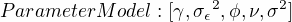

# Table of Contents

1.  [基于层次贝叶斯的空间插值方法](#orgfb5ccc1)
    1.  [问题描述](#orgc9cdb9d)
    2.  [思路](#orgef65b67)
    3.  [MCMC 方法](#org3fff21d)
    4.  [讨论](#orga3da166)
2.  [预测信号源的坐标和发送功率](#orgbe10c5f)
    1.  [模型同上节，但需要获取结论是根据测量数据得到发送节点的坐标和发送功率](#org722a3c7)
    2.  [思路：](#orga65a46c)
        1.  [方法一：](#org245c0b9)
        2.  [方法二：多目标学习。](#org19ab1ad)
    3.  [难点：](#org727681d)

# 基于层次贝叶斯的空间插值方法

## 问题描述

在某一区域内设置若干个感知节点，节点的分布可以采用空间均匀分布的方式，或者随机分布的方式，如下图所示，根据这些节点测量的接收信号强度，推断未测量位置的频谱信号强度。

 

 

## 思路

能够获取的信息只有接收信号强度和感知节点的坐标，可以用两个向量表示：

1

1

信号在空间传播，接收的强度受到三个因素的影响：自由空间传播损耗、阴影衰落和多径效应。自由空间传播损耗可以通过简单的计算获取，多径效应由于其快衰落特性，可以长时间测量取平均的方法消除，而阴影衰落其具备的空间相关性的特点是该方法的研究重点。
信号空间传播模型公式如下：

1

其中  是发送功率， 自由空间传播损耗因子， 是发送节点的位置， 第 i 个感知节点的位置,  是阴影衰落， 是测量误差。
从同一发送位置发出的信号，距离较近的感知节点的阴影衰落的相关性较强，而距离较远的感知节点的阴影衰落的相关性较弱，可以利用这里特点，对整个区域内感知节点的接收数据进行建模。
为简化问题，假设所有感知节点的阴影衰落之间的关系服从复高斯分布，其相关性用用一个相关函数表征（来源于空间统计理论）。在空间统计学中，有一些常用相关函数可供选择，这里选用 mat&acute;{e}rn 相关函数：

1

 是 gamma 函数，  是  阶的贝赛尔函数，  是感知节点间的距，   估计参数。

通过构建一个分层的贝叶斯模型来描述感知数据生成的过程，分为三层，分别为数据模型、过程模型和参数模型：

1

数据模型描述的数据测量过程中的测量误差，在已知发送功率，自由空间传播损耗和阴影衰落的前提下，测量数据是一个相互独立的复高斯分布:

1

过程模型描述阴影衰落的空间相关特性，是一个零均值的复高斯分布，分布的协方差矩阵的每个元素值，通过上文中的相关函数计算获：

1

参数模型描述了整个模型待估参数，参数不是一个固定的值，而是服从某一分布。

1

贝叶斯统计方法：首先根据先验知识，赋予待估计的参数一个无信息或者弱信息的先验分布，而后根据贝叶斯理论，提供获取的监测数据来更新参数的分布，即得到其后验分布。

## MCMC 方法

由于模型中涉及多个参数，难以推导出闭式解，这里选用能够通过数据计算解决贝叶斯问题的，马尔可夫蒙特卡罗（MCMC)方法对问题进行求解。
通过该方法得到的参数分布，可以进一步采用 MCMC 方法对空间其他点（未设置感知节点）的接收功率进行预测，得到的结果也是一个概率分布，而不是一个具体的值。

## 讨论

优点：1.得到的结果是一个分布，是在现掌握的信息条件下的，熵最大的结论。传统插值方法只得到一个插值结果，可能对计算的结果过于乐观。

缺点：1.计算量大，需要消耗的计算资源较多，时效性差；
2.假设阴影衰落复高斯分布是一个简化，与传统方法相比更精确，但并不能完全表征实际的阴影衰落特性，如各向异性。

# 预测信号源的坐标和发送功率

## 模型同上节，但需要获取结论是根据测量数据得到发送节点的坐标和发送功率

## 思路：

### 方法一：

可以使用上节中同样的方法进行。

### 方法二：多目标学习。

利用学习算法解决这个问题：
1.特征是空间若干节点的监测数据
2.数据标签有三个变量，分别是发送功率、坐标 x 和坐标 y。
    在区域内提供提供 N 个不同的发射节点（不同发送功率，不同坐标），获取监测节点的感知数据，来得到 N 组训练数据集。
    当有新的感知数据输入时，利用训练好的模型，来预测发送功率、坐标 x 和坐标 y 的值。

## 难点：

发送功率和位置（x,y）之间的关系会对感知节点的值产生影响，因此需要使用多目标学习的方法解决。

